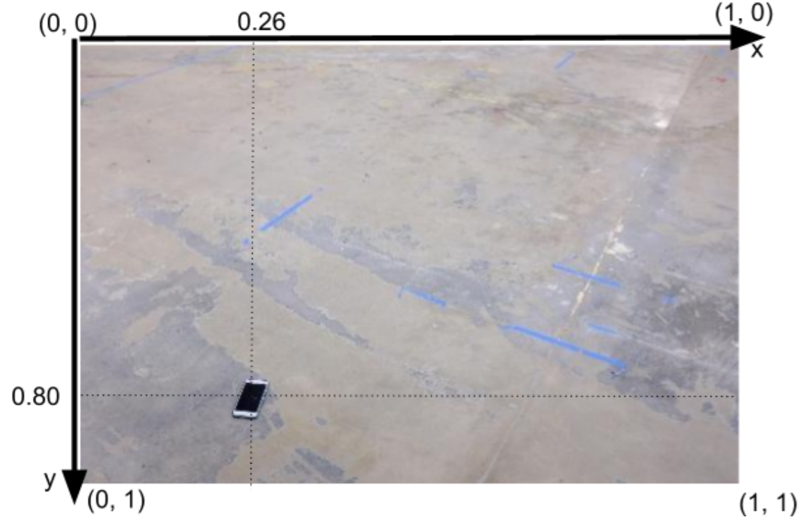

# FIND PHONE

## Description

The challenge is to find a location of a phone dropped on the floor from a single RGB camera image. For this challenge, we consider a normalized XY-coordinate system for an image. This means that the left-top corner of the image is defined as (x,y)=(0,0), left-bottom as (x,y)=(0,1), right-top as (x,y)=(1,0), and right-bottom as (x,y)=(1,1). The phone detector attemps to find the normalized coordinates of the center of the phone.

In the example below, the coordinates of the phone are approximately (x,y)=(0.26,0.80):

## Algorithm

1. Convert RGB image to grayscale image
2. Convert grayscale image to binary image
3. Obtain contours of binary image
4. Determine contour that best matches phone
5. Calculate and print center of phone contour

## Train Phone Finder

The script `train_phone_finder.py` takes a single command line argument which is a path to a folder with labeled images and `labels.txt`. The script attempts to plot the center point of the detected phone for each image in `data`. The resulting images are stored in `detect`.:

`> python train_phone_finder.py ./data`

## Find Phone

The script `find_phone.py` takes a single command line argument which is a path to the jpeg image to be tested. The script prints the normalized coordinates of the phone detected on this test image:

`> python find_phone.py ./data/1.jpg`

## Next Steps

If given more time to improve my algorithm, I would implement Histogram Equalization on the images where no phone was able to be detected. Based on the results in `detect`, most of these instances had to do with images with high contrast that did not create an effective binary image. Histogram Equalization would be able to solve this problem by making the phone darker and the background lighter, allowing for an effective binary image to be created.