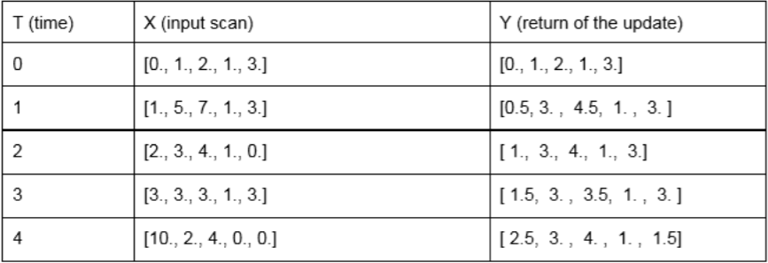

# LIDAR FILTER

## Description

The challenge is to write filters to reduce noise in the data coming from a [LIDAR](https://en.wikipedia.org/wiki/Lidar) sensor attached to a robot. The LIDAR generates scans at a certain rate. Each scan is an array of length N of float values representing distance measures. N is typically in a range of ~[200, 1000] measurements, and it is fixed. Measured distances are typically in a range of [0.03, 50] meters. Each time a scan is received, it will be passed on to the filters. Each filter object has an **update** method, that takes a length-N array of ranges and returns a filtered length-N array of ranges. My implementation uses [Numpy](http://www.numpy.org/) on [Python 2.7](https://www.python.org/download/releases/2.7/).

## Range Filter

The `lidar_filter.py` module contains a `RangeFilter` object that takes as numerical parameters `range_min` and `range_max`. The `RangeFilter` object has an `update` method that takes as a parameter a single N-dimensional array `lidar_data`. The `update` method returns an N-dimensional array that crops all the values in `lidar_data` that are below `range_min` and replaces them with `range_min`, as well as crops all the values that are above `range_max` and replaces them with `range_max`.

To see the full docstring for `RangeFilter`, type `pydoc lidar_filter.RangeFilter` in the command line.

### Code Example

```python
>>> from lidar_filter import RangeFilter

>>> lidar_data1 = [-5,-4,-3,-2,-1,0,1,2,3,4,5]
>>> range_min = -3
>>> range_max = 2

>>> range_filter1 = RangeFilter(range_min,range_max)
>>> new_data1 = range_filter1.update(lidar_data1)
>>> print "Output: " + str(new_data1)

Output: [-3 -3 -3 -2 -1  0  1  2  2  2  2]

>>> lidar_data2 = [-9,5,2,-1,0,-3,-5,6,7,-4]
>>> range_min = -3
>>> range_max = 3

>>> range_filter2 = RangeFilter(range_min,range_max)
>>> new_data2 = range_filter2.update(lidar_data2)
>>> print "Output: " + str(new_data2)

Output: [-3  3  2 -1  0 -3 -3  3  3 -3]

```

## Temporal Median Filter

The `lidar_filter.py` module contains a `MedianFilter` object that takes as numerical parameters `D` and `N` where `D` is the desired number of current + previous scans and `N` is the length of the incoming LIDAR data array (`N` must be consistent for each `MedianFilter` object). The `MedianFilter` object has an `update` method that takes as a parameter a single N-dimensional array `lidar_data`. The `update` method returns an N-dimensional array that is the median of the current and previous `D` scans of LIDAR data arrays. For the first `D` scans, the filter returns the median of all the scans so far.

To see the full docstring for `MedianFilter`, type `pydoc lidar_filter.MedianFilter` in the command line.

### Code Example

```python
>>> from lidar_filter import MedianFilter

>>> D = 3
>>> N = 5

>>> median_filter = MedianFilter(D,N)

>>> lidar_data0 = [0,1,2,1,3]
>>> print "Output: " + str(median_filter.update(lidar_data0))

Output: [0. 1. 2. 1. 3.]

>>> lidar_data1 = [1,5,7,1,3]
>>> print "Output: " + str(median_filter.update(lidar_data1))

Output: [0.5 3.  4.5 1.  3. ]

>>> lidar_data2 = [2,3,4,1,0]
>>> print "Output: " + str(median_filter.update(lidar_data2))

Output: [1. 3. 4. 1. 3.]

>>> lidar_data3 = [3,3,3,1,3]
>>> print "Output: " + str(median_filter.update(lidar_data3))

Output: [1.5 3.  3.5 1.  3. ]

>>> lidar_data4 = [10,2,4,0,0]
>>> print "Output: " + str(median_filter.update(lidar_data4))

Output: [2.5 3.  4.  1.  1.5]

```

### Visual Example

The **temporal median filter** returns the median of the current and the previous D scans:

> yi(t) = median( xi(t) , xi(t-1) , ... , xi(t-D) )

where x and y are input and output length-N scans and i ranges from 0 to N-1.

Here is a visual example of the output (Y) with D=3 for and input (X) of dimension N=5 for the first 5 updates:

